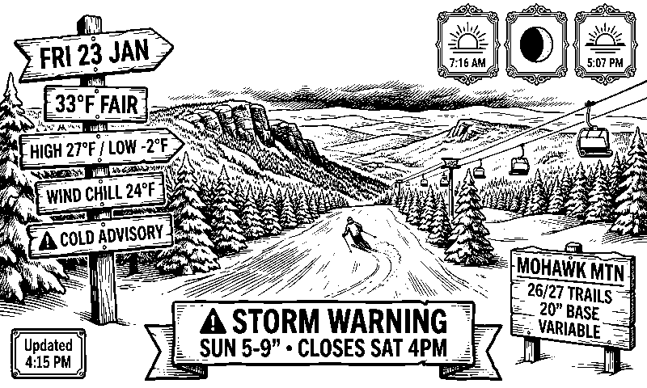

# TRMNL Image Agent

Generate and push custom images to TRMNL e-ink displays.

## Current Image



## Prerequisites

- A TRMNL device
- TRMNL account with Developer Edition add-on ($19 one-time)
- Webhook Image plugin enabled

## Setup

### Configure Environment

Get the webhook URL from 1Password:

```bash
export TRMNL_WEBHOOK_URL=$(op read "op://Development/Market TRMNL Webhook/notesPlain")
```

## Usage

### Push an Image

```bash
./push_to_trmnl.sh output/my-image.png
```

## Image Requirements

| Spec | Value |
|------|-------|
| Resolution | 800x480 pixels |
| Format | PNG, JPEG, or BMP |
| Max size | 5MB |
| Color | 1-bit (black/white) works best |

### Tips for Best Results

- Use **Floyd-Steinberg dithering** for photos
- Avoid dithering for text-heavy images (keeps text sharp)
- Convert to 1-bit before uploading for predictable results

### Convert with ImageMagick

```bash
convert input.jpg \
  -resize 800x480^ \
  -gravity center \
  -extent 800x480 \
  -dither FloydSteinberg \
  -colors 2 \
  PNG8:output.png
```

## Rate Limits

- **12 uploads per hour** per webhook
- Plan your update frequency accordingly

## Resources

- [TRMNL Webhook Image Docs](https://help.usetrmnl.com/en/articles/13213669-webhook-image-experimental)
- [TRMNL Design Framework](https://usetrmnl.com/framework)
- [E-Ink Image Preparation Guide](https://learn.adafruit.com/preparing-graphics-for-e-ink-displays)
